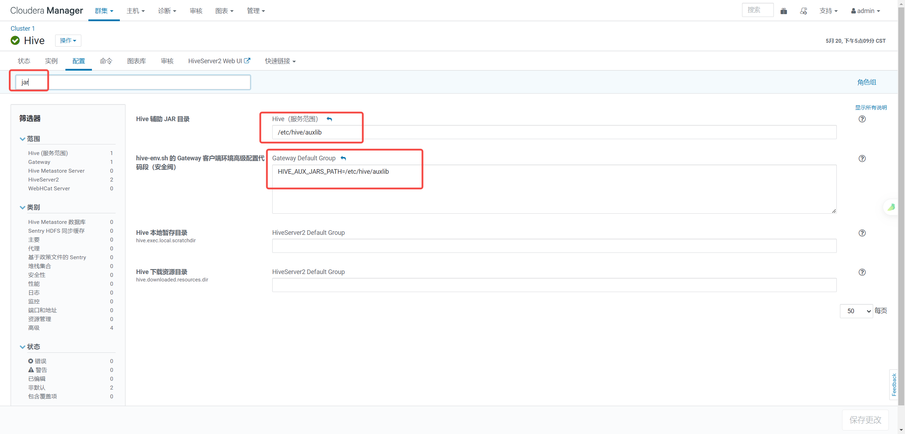

# 1. 文档目的

帮助使用 hive sdk 来查询  使用 vsw 作为底层存储的分区表。

包括如何 配置部署hive sdk，如何创建分区表、上传 vsw 数据，创建分区等使用步骤。


# 2. 参考文档

Hive Serde 官方文档：

[SerDe - Apache Hive - Apache Software Foundation](https://cwiki.apache.org/confluence/display/Hive/SerDe)

Hive 开发指南：

https://cwiki.apache.org/confluence/display/Hive/DeveloperGuide#DeveloperGuide-HowtoWriteYourOwnSerDe

Hive Serde 源码 （OpenCSVSerde）：

https://github.com/apache/hive/blob/release-2.3.8-rc3/serde/src/java/org/apache/hadoop/hive/serde2/OpenCSVSerde.java


# 3. 架构概述

SerDe是Hive 的序列化和反序列化的组件，主要用在读写数据上，下面就是Hive 读写的过程

读取 HDFS files --> InputFileFormat --> <key, value> --> Deserializer --> Row object

写出 Row object --> Serializer --> <key, value> --> OutputFileFormat --> HDFS files

编写自己的 Serde：VDataHiveSerDe，继承 AbstractSerDe,重写相关方法：initialize，deserialize

实现 RecordReader  接口，自定义 VDataHiveReader，读取vsw 文件，调用 java sdk解析 vsw，然后用 VDataHiveSerDe.deserialze() 方法去反序列化数据。

VDataHiveSerDe 暂时只支持读取vsw 文件，暂不支持序列化到 vsw。


# 4. 配置Hive

## 4.1 上传并配置 vdata hive sdk 

1. 在 hdfs 上创建放置 vdata-sdk-hive 的文件夹 

```sh
mkdir -r /tmp/vdata_hive_sdk
```


2. 上传 exceeddata-vdata-sdk-hive-2.8.0-hadoop-3.0.0-cdh6.3.4.jar 和 exceeddata-vdata-sdk-java-full-2.8.0.jar 两个jar 包到该文件夹之中。


3. 同步到每一台服务器之上。

```sh
scp -r /tmp/vdata_hive_sdk node001:/etc/hive
scp -r /tmp/vdata_hive_sdk node002:/etc/hive
scp -r /tmp/vdata_hive_sdk node003:/etc/hive
```
* 建议用可以根据实际需求放在/opt/hive/lib目录下 *


## 4.2 配置Hive并重启

如下图所示，在cdh 页面上，hive ，配置里面，搜jar，配置 Hive辅助JAR目录，hive-env.sh的Gateway客户端环境高级配置代码段(安全阀) 这两个参数为上面创建的文件夹。



4. 重启hive 服务。


# 5. 创建表并使用

本章节将Step by Step建立一张通过支持分区读VSW的Hive表，导入并读取其中的数据。

Hive表以VIN前缀和年-月-日作为分区。


## 5.1 创建hive 分区表

```SQL
CREATE EXTERNAL TABLE IF NOT EXISTS table_name
  ( `_device` string,
    `_time` timestamp,
    EB_OutputRodAct double, 
    EB_MaxAchievableMasterCylinderPressure double,
    ...
  )
  partitioned by(vin STRING,dt STRING)
  ROW FORMAT SERDE 'com.exceeddata.sdk.vdata.hive.v2.VDataHiveSerDe'
  STORED AS INPUTFORMAT 'com.exceeddata.sdk.vdata.hive.v2.VDataHiveInputFormat'
  OUTPUTFORMAT 'org.apache.hadoop.hive.ql.io.HiveIgnoreKeyTextOutputFormat'
  LOCATION 'hdfs_path/table_name';
```

数据存储格式：vsw。**（该格式只支持  sql查询，不支持插入写数据到 vsw。）**

文件名：**文件名应为 device_rollout_datetime.vsw 格式**，例如：VIN2_4124_20210629111127298.vsw

table_name 分区表名。

`_device` string,  `_time` timestamp 为固定字段。

_device表示 vin号，为 vsw文件名 开始到第一个下划线截取的。

_time 表示时间，为每一行vsw 的时间。

**EB_OutputRodAct double, EB_MaxAchievableMasterCylinderPressure double,... 表示 需要查询的vsw 里面的信号名。**

partitioned by(vin STRING,dt STRING)  ：分区键，可以自定义，该表表示有两个分区键，第一个为vin，第二个为时间。可以根据业务自己设计。**（最好两个分区键）**

ROW FORMAT SERDE 'com.exceeddata.sdk.vdata.hive.v2.VDataHiveSerDe' 

STORED AS INPUTFORMAT 'com.exceeddata.sdk.vdata.hive.v2.VDataHiveInputFormat' 

OUTPUTFORMAT 'org.apache.hadoop.hive.ql.io.HiveIgnoreKeyTextOutputFormat'

这三句表示让hive 使用我们自己的 序列化器和反序列化器，为固定建表的属性，无需修改。

LOCATION 'hdfs_path/table_name' ：表示数据存放在hdfs 之中的路径。**需要用户有读该路径的权限。**


## 5.2 添加分区并上传数据

```SQL
  alter table table_name add if not exists partition (vin='VIN1',dt='20210629');  
```

 partition (vin='VIN1',dt='20210629');  表示创建一个二级索引。

创建好之后，hdfs 之中自动创建文件目录，格式为：hdfs_path/table_name/vin=VIN1/dt=20210629/

```HTMLBars
 hdfs dfs -ls  /user/root/upload/admin/admin/lxl/hive_sql/t1/vin=VIN2/
```


## 5.3 导入数据并查询数据

上传vsw 数据,创建好索引之后，hive 就会在hdfs 之中创建好相应的路径，把 相应的vsw 数据放入到创建好的分区之中，就可以进行查询。

```HTMLBars
hdfs dfs -put VIN2_4124_20210629111127298.vsw /user/root/upload/admin/admin/lxl/hive_sql/t1/vin=VIN2/dt=20210629

hdfs dfs -ls  /user/root/upload/admin/admin/lxl/hive_sql/t1/vin=VIN2/dt=20210629
```


查询数据：

```SQL
select * from table_name where vin='VIN1' and dt = '20210629' limit 10;
```


